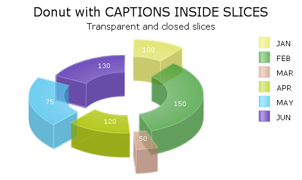
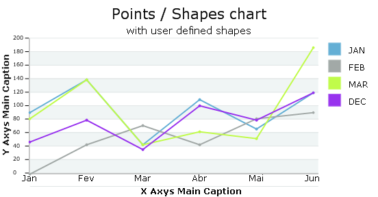
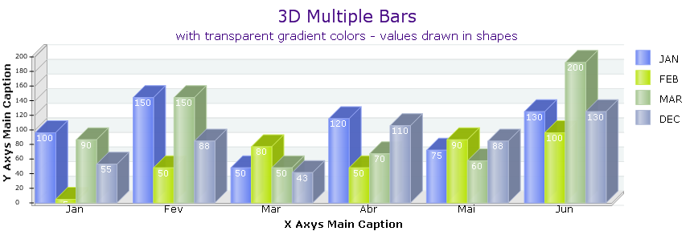
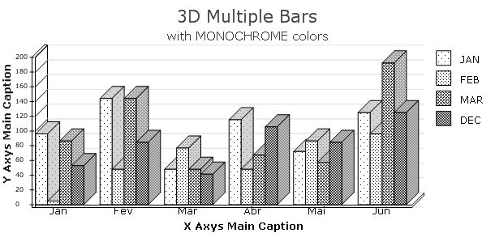
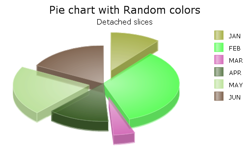
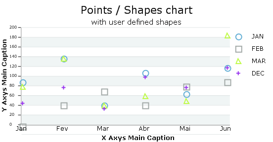
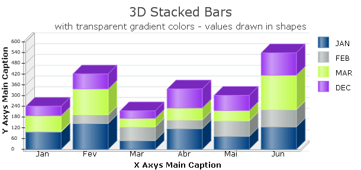
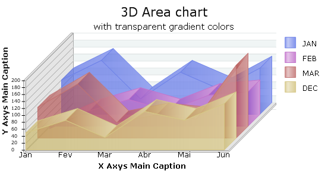
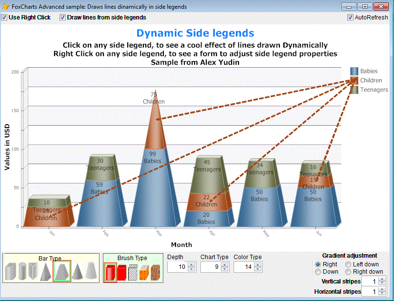
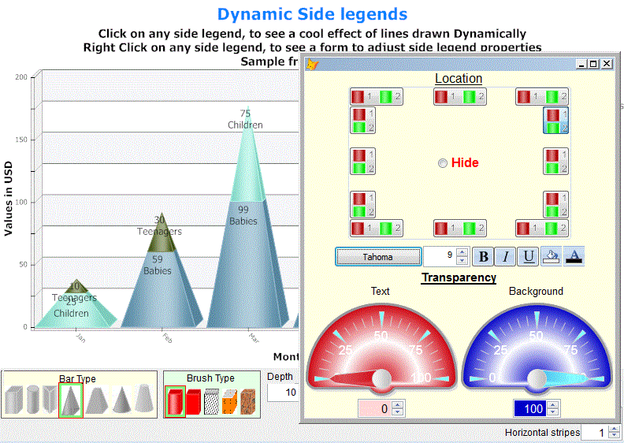

# FoxCharts
**A class based on the ImageCanvas class from GdiPlusX that allows VFP developers to directly draw charts and graphs.**

Project Manager: Cesar ([vfpimaging@hotmail.com](mailto:vfpimaging@hotmail.com)) Versions till 1.37
Project Manager: YudinAlexKiev (alex.yudin.49@mail.ru) Versions 1.4x

Goals of FoxCharts:
* Create good looking and modern charts in pure VFP code
* NO ActiveX components
* Easy to setup
* Easy to customize
* Easy to save to disk or print
* Open Source
* Benefit from all the GdiPlusX drawing capabilities, allowing users to modify the charts the way they like
* Save as EMF, resulting in perfect charts when printed in VFP reports
* Full control of the chart shapes
* Tooltips
* Mouse control

Prerequisites:
* Visual FoxPro 9 and the GdiPlusX library from VFPX 

Currently available:
* Single Bars, Multiple Bars, Stacked Bars, Shapes or points, Lines, Area, Pie and Donut charts, in various color variations, using gradients, custom colors, transparent, basic and random colors.
* Titles, subtitles and legends
* Scales, Both Axis
* Drawing texts inside shapes

## Examples

More detailed information about this release can be found at the TXT file that is in the FoxCharts zipped file.

To get more familiarized with what FoxCharts can do, download the file above and run the samples available, playing with all the options.

Just start running DEMOSTART.PRG in the "Samples" folder.

## JRN FoxCharts Tools

This toolkit contains a couple of add-on tools not part of FoxCharts proper:
* **VisualChartDesigner**: a tool which allows either the developer or an end user to make changes to the FoxCharts properties and see their immediate effect. VisualChartDesigner can be added to any existing chart by adding a single control to the FoxCharts container of a chart: cmdChartOptions of VisualChartDesigner.vcx
* **GetChartDataFromRows**: a PRG to convert data series which originates in rows into the format that FoxCharts requires (where each data series is in a field).

The JRN_FoxCharts_Tools folder contains the following items:
* VisualChartDesigner.VCX
* GetChartDataFromRows.PRG
* A Documentation folder, which contains a separate document for each of the tools.
* A Samples folder, which contains VisualChartDesigner_Sample.SCX
* An additional form and class; you will not reference either of these, but both are used by the VisualChartDesigner.

## Beta Update

*New features:*
* Introduced new Bar Types: Cone, Conoid, Pyramid and truncated pyramid (Frustum).
* Introduced new Brush Types: HatchBrush Color, Textures Brush
* Right-clicking on the SideLegends in the chart, can call a new form that allows you to interactively apply changes to the way the side legends appear. You can change the Legend positions, colors, and other character formatting.

*New properties:*
* GradientShapeDirection: Numeric, determines the Gradient Brush direction (0-3).
* GradientVertCount and GradientHorCount: Numeric, determines the Shape Gradient Brush stripes count (vertical and horizontal)

*Fixes:*  
Fix in "System.app". The distributed version avoids some bugs due to LOCAL variables declarations inside TRY/CATCH. May work faster in local net.

*VERY IMPORTANT:*  
Since this new version brings several modifications, the new and current Beta version is a subclass of the original and latest FoxCharts version v1.37. The new class is in the Foxcharts1.46_Beta folder, named FoxChartsBeta.vcx.

All new samples, the ones that will benefit from the newest features, are in the SamplesBeta folder.

Start playing with the ChartsSample_ArrowsInLegend.scx form.
- Change the spinner values to see the new charts available
- Click on the Side Legends, to see cool stripes 
- Right-click the over the SideLegends to call the new SideLegends form, and play with the new possibilities!

*Info for version 1.42 ALPHA*
- all objects of chart react on mousemove showing its contour
- all objects have their own form to adjust. Just Right Click on them.
- Right click on chart (not on objects) will call form to adjust common properties
- For ChartType=3 (single type) one can see arrows that show values o​f the increments
- Title and subtitle can use chr(13)+chr(10) inside
- One can store properties in memo field of file ChartsList.
- Shape legend changed

*Info for version 1.43 ALPHA*
- New chart object- Comment. You can add new comment, edit and delete it(right click). As well as drag and drop existing comments object on chart.
- Start form Chartssample_v1_4x.scx from project. This is sample for all v.4x versions features.

*Info for version 1.43 BETA*
- Fixed bugs
- OO Writer report

*Info for version 1.44 Beta*
* New form charts_rowchange.scx demonstrates generating charts on  AfterRowColChange event of grid.
* Simple form ChartExport.scx demonstrates calls ChartExport.prg that send Chart image to Clipboard, MS Excel, MS Word, OO Writer and just to printer with no form at all.
* Read comments inside this ChartExport.prg

*Info for version 1.45*  
* New form ChartsMovie shows charts speed for different properties

*Info for version 1.45.2*  
* Multi BarChart.
* Collection Fields has new property Bartype.
* Look form AfterRowColChange.

*Info for version 1.45.3*  
* New propery "News". Form Chartssample_v1_4x start with Form.foxcharts1.News = .F.
* If you change any property News become = .T.
Checking GetChartProperties(3, .F. ) to be empty gives the same result as News=.F.

*Info for version 1.46 Beta*  
* New form chartssamples_v1_4x stands for calling forms of versions 1.4x
* New property "Sleep" - logical. When Sleep=.T. prevents unnecessary calling DrawChart (like Resize method).
* Form charts_rowchange.scx shows way to animated changing charts

*Info for version 1.46.1 Beta*  
* Now 3 1.4x sample forms include button "Form objects" (left top side) to look all form objects and their properties, methods and events.
* Object Shapes includes non visual auxiliary objects - one for each shape on canvas.
You can use this objects in your programs.

## Acknowledgements

Special thanks to: Bo Durban, James R. Nelson and Alex Yudin for their big contributions developing new possibilities.

Also to the very big list of contributors who have given lots of feedback, suggestions, reported bugs, asked for features.
You all rock guys !

THANKS SO MUCH !
